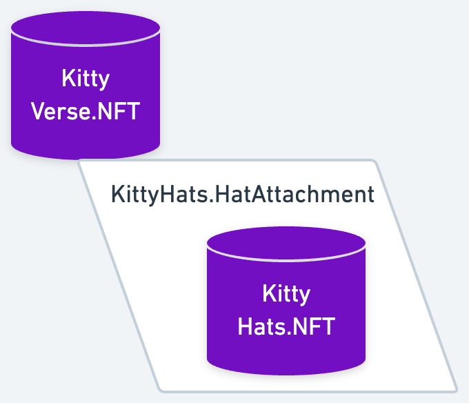

# 😸 KittyVerse + KittyHats 🎩

To showcase how attachments unlock **_permissionless composability_** on Flow, this tutorial will walk you though making your
own cat-inspired NFT collection and a wardrobe of hats to go along with them. Let's put some hats on some cats!

## What is composability?

Before digging in, let's talk about what we mean by **_composability_**.

<Callout type="success">

Composability is the ability for existing components in one construction to be reused and even extended for another 
purpose. <br/>

Think of composable architectures like
[building with legos](https://twitter.com/cdixon/status/1450462593232089088?s=20) - you build something you need as a
block or set of blocks and someone else can come along and use those same blocks to build something entirely new.<br/>

Composability on Flow, especially with attachments, is permissionless because not only can you build with existing 
components, but no one can stop you from doing so - hence the term permissionless!

</Callout>

Permissionless composability is one of the unique characteristics of decentralized app development because, as builders,
we can freely compose richer or derivative functionalities on top of any existing contracts from other applications or
communities. Contracts that you deploy which interact with other contracts are not subject to internal changes or
control by the contract you composed it upon. 

Cadence is uniquely suited for composable architectures because Cadence contracts can compose other contracts. As a
developer, this means that working with contracts is very similar to working with libraries in other languages.
Simply import them into your contract, scripts, or transactions, and they will be loaded dynamically on-demand for you
to leverage their types and functionalities. See
[contract borrowing](https://developers.flow.com/cadence/language/contracts#borrowing-a-deployed-contract) for a
unique example of this.

Less duplicate code, easier to bootstrap attention and adoption, and users benefit from the utility you built into 
something they already presumably own and love - win-win-win!

# Overview

At the end of this tutorial, you'll have explored and created your own composable NFTs by doing the following:

- Created a base NonFungibleToken contract - KittyVerse
- Created an attachment-focused NonFungibleToken contract - KittyHats
- Setup collections for both NFTs
- Mint a KittyVerse NFT
- Mint a KittyHats NFT
- Attach a KittyHats NFT to your KittyVerse NFT

Here's a simple diagram of what you'll be building:



Notice that there are three primary components to this construction:

1. **Base** - KittyVerse NFT
2. **Attachment** - KittyHats HatAttachment
3. **Attached Resource** - KittyHats NFT

With that in mind, let's move on to building!

# Define our Base NFT - KittyVerse

<Callout type="info"> 

Instructions that require you to take action are always included in a callout box like this one.
These highlighted actions are all that you need to do to get your code running, but reading the rest is necessary to
understand the language's design.

</Callout>

## NonFungibleToken Standard

For your first contract, you'll be implementing the NFT standard in the KittyVerse NFT contract.

<Callout type="success">

The NonFungibleToken standard is a contract interface that defines NFT on Flow. If you find this tutorial too dense,
take a look at the [Non-Fungible Token tutorials](https://developers.flow.com/cadence/tutorial/non-fungible-tokens-1)
for more focused coverage on the standard.

</Callout>

For our purposes here, we're going to implement a single contract interface. For production contracts, you'll want to
also familiarize yourself with the MetadataViews and ViewResolver contract interfaces found in the 
[flow-nft repo](https://github.com/onflow/flow-nft).

Before continuing, let's briefly cover non-fungible tokens on Flow. In essence, an NFT on Flow is a resource defined in
a NonFungibleToken implementing contract, and is represented by a unique ID.

The NFT resource itself is very simple. You can see the basic resource interface and implementing resource pair here:

```cadence
pub resource interface INFT {
    pub let id: UInt64
    
    /// Function that returns all the Metadata Views implemented by a Non Fungible Token
    ///
    /// @return An array of Types defining the implemented views. This value will be used by
    ///         developers to know which parameter to pass to the resolveView() method.
    ///
    pub fun getViews(): [Type] {
        return []
    }

    /// Function that resolves a metadata view for this token.
    ///
    /// @param view: The Type of the desired view.
    /// @return A structure representing the requested view.
    ///
    pub fun resolveView(_ view: Type): AnyStruct? {
        return nil
    }
}

/// Requirement that all conforming NFT smart contracts have
/// to define a resource called NFT that conforms to INFT
///
pub resource NFT: INFT {
    pub let id: UInt64
}
```

As you might imagine, an NFT ID is not very interesting on its own. To make it more interesting, the standard interface
also includes methods to retrieve metadata about the NFT - `getViews()` and `resolveViews()` to retrieve supported views
and resolve a specific view respectively. These methods in the `INFT` interface are implemented as default methods which
is why you don't see them in the `NFT` above, but can be overridden in the implementing contract.

The NonFungibleToken contract interface also includes another nested type - `NonFungibleToken.Collection` - which as you
can guess is a collection of NFTs. This is the resource that stores NFTs in the owner's account storage. A `Collection`
implements standard interfaces `Receiver`, `Provider`, and `CollectionPublic` which expose `deposit()`, `withdraw()`,
and public helper methods respectively.

```cadence
/// Requirement for the concrete resource type
/// to be declared in the implementing contract
///
pub resource Collection: Provider, Receiver, CollectionPublic {

    /// Dictionary to hold the NFTs in the Collection
    pub var ownedNFTs: @{UInt64: NFT}

    /// Removes an NFT from the collection and moves it to the caller
    ///
    /// @param withdrawID: The ID of the NFT that will be withdrawn
    /// @return The resource containing the desired NFT
    ///
    pub fun withdraw(withdrawID: UInt64): @NFT

    /// Takes a NFT and adds it to the collections dictionary
    /// and adds the ID to the ID array
    /// 
    /// @param token: An NFT resource
    ///
    pub fun deposit(token: @NFT)

    /// Returns an array of the IDs that are in the collection
    ///
    /// @return An array containing all the IDs on the collection
    ///
    pub fun getIDs(): [UInt64]

    /// Returns a borrowed reference to an NFT in the collection
    /// so that the caller can read data and call methods from it
    ///
    /// @param id: The ID of the NFT that want to be borrowed
    /// @return A reference to the NFT
    ///
    pub fun borrowNFT(id: UInt64): &NFT {
        pre {
            self.ownedNFTs[id] != nil: "NFT does not exist in the collection!"
        }
    }
}
```

The final small, but necessary pieces of an NFT implementing contract are the contract variable `totalSupply` and the
contract events.

```cadence
/// The total number of tokens of this type in existence
pub var totalSupply: UInt64

/// Event that emitted when the NFT contract is initialized
///
pub event ContractInitialized()

/// Event that is emitted when a token is withdrawn,
/// indicating the owner of the collection that it was withdrawn from.
///
/// If the collection is not in an account's storage, `from` will be `nil`.
///
pub event Withdraw(id: UInt64, from: Address?)

/// Event that emitted when a token is deposited to a collection.
///
/// It indicates the owner of the collection that it was deposited to.
///
pub event Deposit(id: UInt64, to: Address?)
```

Implementing each of these is all there is to creating your own NFT contract on Flow. In the next section, we'll walk
through what this looks like for KittyVerse.

## Contract Overview

<Callout type="warning">

It is important to remember that while this tutorial implements a working non-fungible token, it has been simplified for
educational purposes and is not what any project should use in production. See the Flow Fungible Token standard for the
standard interface and example implementation. Additionally, check out the 
[Kitty Items Repo](https://github.com/onflow/kitty-items) for a production ready version!

</Callout>

- Contract interface implementation
    - Events
    - Nested resource definitions
- Attribute overview
- Opportunities to extend the contract

## Deploy KittyVerse contract

- Deploy NonFungibleToken to `0x01`
- Deploy KittyVerse to `0x02`

## Setup account & Mint KittyVerse NFT

- send `tx_01_setup_kittyverse_account.cdc` signing with `0x02`
- send `tx_02_mint_kittyverse_nft.cdc` signing with `0x02`
- send `tx_02_mint_kittyverse_nft.cdc` again signing with `0x02`
- query NFT.id - execute `script_01_get_kittyverse_ids.cdc` providing `0x02` as argument
    - see two unique NFT IDS - take note of them, next let's prep them some hats

# Define our Attachments - KittyHats

While you just created KittyVerse NFT to serve as a basis for attachments, recall that attachments enable us build on
**_any_** resource including existing NFTs. This means that we could have just as easily chosen an existing NFT project
and started building our attachments contract for those existing NFTs.

## Attachments

- What are they?
    - In Cadence
    - Simple mental model
        - "Like glue between resources"
        - 
- Why do they matter?
    - Can create attachments for anything without needing original developer's:
        - Participation
        - Permission

### Overview

- Conceptual
    - Attachments are a special type that can be added to resources (doc link needed)
    - You might be tempted to simply define all your functionality in the attachment, but it's important to know that
      attachments are not resources.
        - You'll lose the existence and uniqueness guarantees inherent to resources as well as make access control
          significantly harder for yourself
        - As mentioned earlier, attachments are best thought of as glue between resources
            - Define an attachment that can hold some resource, designed to be added to a base resource
    - Note that you need access to the base resource to add an attachment to it
        - So to add an attachment to an NFT, you need to first withdraw that NFT from its Collection
- Syntax
    - Accessing an attachment

        - In the general sense, accessing an attachment looks similar to indexing a dictionary on a static type 
          declaration where the return type is an optional reference to the attachment type
        ```cadence
        let attachmentRef: &A? = baseResource[A]
        ```
        - In the case of KittyVerse and KittyHats, you'll see the following:
        ```cadence
        let attachmentRef: &KittyHats.HatAttachment? = nft[KittyHats.HatAttachment]
        ```
    - Adding an attachment
        - Note that unlike resources, attachments can be created anywhere, including outside of the scope of the 
          contract that defines them
          - This is an important consideration for how you design your attachments - you do not have the initialization
            control that you do with resources
            - Attachments can only be created while being attached to a base resource - attachments can only be created
              in the context of an `attach` expression
        - Let's take a look at the general case of adding an attachment to a base resource. Adding an attachment
          requires us to reassign the base resource to the result of the `attach` keyword
        ```cadence
        let resourceWithAttachment <- attach A() to <- baseResource
        ```
        - And in the case of KittyVerse and KittyHats, you'll see the following helper method that adds a HatAttachment
          to a KittyVerse NFT:
        ```cadence
        access(self) fun addAttachment(toNFT: @KittyVerse.NFT): @KittyVerse.NFT {
            // If attachment already exists, return
            if toNFT[HatAttachment] != nil {
                return <-toNFT
            }
            // Otherwise, add the attachment
            return <- attach HatAttachment() to <- toNFT
        }
        // Otherwise, add the attachment
        return <- attach HatAttachment() to <- toNFT
        ```
   
## Contract Overview

### Why Attachments?

- Why are we defining attachments instead of simply adding a field on the KittyVerse NFTs that can store hats?
    - If we didn't define KittyVerse, we couldn't do that - no way we can alter the underlying contract
        - Attachments allow us to permissionlessly extend existing resources with new data and functionality
        - Why would we do that anyway?
            
            - If KittyVerse already has an enthusiastic community behind it
    - Let's say we're defining both, why use attachments?
        - Building with attachments is a clear signal that you're designing for this permissionless composability
            - You encourage others to define their own sorts of attachments for KittyVerse NFTs

### NFT

- Definitions

### HatAttachment

- Common misconception: The attachment is the thing
    - Correction: Attachments glue the thing(s)
        - As mentioned previously, attachments are like glue between resources
    - As of now, attachments can be fully referenced anywhere the NFT can be referenced - this can complicate access 
    control
        - We made `removeHat()` `access(contract)` and callable in Collection only
            - Link to access modifier docs here: https://developers.flow.com/cadence/language/access-control
        - If we didn't, anyone would have been able to remove a KittyHats NFT from via a user's Collection public 
        Capability
- Basically enabling the base resource - KittyHats NFT in this case - to receive a KittyHats NFT

### Collection

- Your standard Collection
- Added ability to remove KittyHats from KittyVerse NFTs and return them to their Collection

## Deploy KittyHats contract

- Deploy KittyHats to `0x03`

## Setup account & Mint KittyHats NFT

- send `tx_03_setup_kittyhats_account.cdc` signing with `0x02`
- query NFT.id - `script_03_get_kittyhats_ids_and_names.cdc` providing `0x02` as argument
    - see one id and note it for the next step

## Put hats on cats

- send `tx_05_attach_hat_to_cat.cdc` signing with `0x02`
    - provid KittyHats.NFT.id & KittyVerse.NFT.id of your choice
- query cats & hats - `script_04_get_kittyverse_names_and_hat` providing `0x02` as argument
    - see the KittyVerse.NFT names - one should have your hat name and the other should have nil - Your cat has a hat!
- query KittyHats NFT IDs - `script_03_get_kittyhats_ids_and_names.cdc` providing `0x02` as argument
    - see that your hat is no longer in your Collection

## Remove the hat

- send `tx_06_remove_hat_from_cat.cdc` signing with `0x02` and providing your KittyVerse NFT id name
- query cats & hats - `script_04_get_kittyverse_names_and_hat` providing `0x02` as argument
    - see that your cat's hat has been removed
- query KittyHats NFT IDs - `script_03_get_kittyhats_ids_and_names.cdc` providing `0x02` as argument
    - see that your hat is back in your Collection

# Considerations

- Great for
    - Building on existing resources uilding in other contracts 
    - Establishing a pattern that encourages others to build on those resources you're creating
- Gotchas: There are some things to bear in mind when working about attachments
    - Accessing attachments of a given type requires a static type declaration
    - Attempting to add an attachment to a resource when one already exists will result in a runtime error
        - This is why we check if an attachment already exists before adding one in the example above
        - You'll want to lean on simple helper methods to conditionally add attachments within your contracts
    - Since attachments are native to the language, there is no way to avoid the emergence of attachments on the things
      you deploy to the wild

# Extra Credit

- Implement MetadataViews and ViewResolver interfaces
    - Simple implementation
    - Add image URIs to the NFTs
- Add Admin resources to both contracts to customize
    - Enable addition/removal of possible cats & hats + greetings
    - Private minting
- Consider: How would you enable a public mints accepting FungibleTokens?
- Can you think of any other use cases for attachments?
    - Think about this - we just unlocked the ability for an NFT to own other NFTs
        - Now extend it - why just own one NFT? What about a whole Collection? What else could NFTs own?
    - Take a look at Flowverse projects and start building!